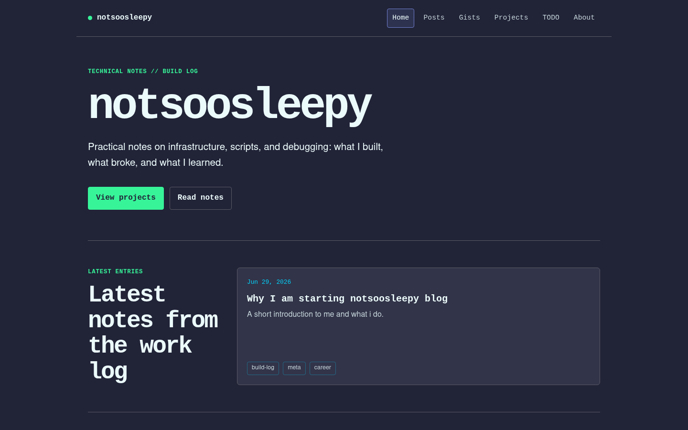
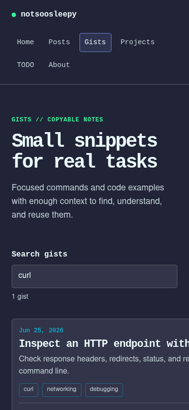

## Outcome

notsoosleepy is my public technical notebook and portfolio. It gives short fixes,
longer posts, project case studies, and unfinished work distinct places while keeping
all content in one version-controlled repository.

The deployed site is available at
[blog-site.runcorx.workers.dev](https://blog-site.runcorx.workers.dev), and the source
is public on [GitHub](https://github.com/notsooSleepy/blog-site).



<p class="media-caption">The desktop homepage keeps the current work and latest writing visible without a separate landing page.</p>

## Architecture

The site uses Astro's static output. Markdown and JSON content pass through typed
content collections, then route templates turn those entries into static pages.

```text
Markdown and JSON
        |
Glob loaders and Zod schemas
        |
Typed content entries
        |
Build-time route generation and shared layout
        |
Static pages, assets, RSS, sitemap, and robots.txt
        |
Cloudflare Workers
```

The main pieces are:

- Astro content collections for posts, gists, projects, and the public TODO list.
- Shared layouts and cards for consistent navigation, metadata, and presentation.
- Small client-side enhancements for gist search, tag filtering, copy controls, and
  card interaction.
- Playwright coverage for routes, accessibility-critical navigation, gist workflows,
  discovery files, and metadata.
- A production checker for HTTPS routes, canonical URLs, assets, and external links.

## Codebase walkthrough

The repository is deliberately small, but its boundaries are explicit. Content enters
through schemas, routes are generated at build time, shared behavior stays in one layout,
and client-side code is limited to workflows that need it.

### Content is a typed input

Astro content collections turn Markdown into structured build input. The project
collection uses a glob loader to find entries and a Zod schema to reject incomplete or
invalid frontmatter before a page can be generated.

```ts
const projects = defineCollection({
  loader: glob({ pattern: "**/*.md", base: "./src/content/projects" }),
  schema: z.object({
    title: z.string(),
    description: z.string(),
    date: z.coerce.date(),
    status: z.enum(["active", "paused", "done"]),
    tools: z.array(z.string())
  })
});
```

For an Astro learner, the important point is that Markdown is not treated as an
unvalidated string. For a maintainer, this creates a clear contract: listing cards and
detail pages can rely on every project having the same required fields. The cost is a
small amount of frontmatter ceremony for each entry.

[View the pinned collection schema](https://github.com/notsooSleepy/blog-site/blob/d94fffa14c0e88e12c6894cb267f3b4ea9c50dab/src/content.config.ts#L25-L34).

### Detail routes are generated at build time

The project detail route asks Astro for every project during the build. Each content ID
becomes a URL parameter, and the full entry is passed to the page as a prop.

```astro
export async function getStaticPaths() {
  const projects = await getCollection("projects");
  return projects.map((project) => ({
    params: { slug: project.id },
    props: { project }
  }));
}

const { project } = Astro.props;
const { Content } = await render(project);
```

`getStaticPaths()` is the bridge between content and routing: it produces one static page
per entry without a database lookup or application server at request time. Adding a
project therefore changes the build output, not the runtime architecture.

[View the pinned project route](https://github.com/notsooSleepy/blog-site/blob/d94fffa14c0e88e12c6894cb267f3b4ea9c50dab/src/pages/projects/%5Bslug%5D.astro#L5-L17).

### The shared layout owns cross-cutting behavior

Every route passes its title, description, and page type into one layout. That layout
derives the canonical URL and emits the metadata that should remain consistent across
posts, gists, projects, and index pages.

```astro
const pageTitle = title === "notsoosleepy" ? title : `${title} | notsoosleepy`;
const canonicalUrl = new URL(Astro.url.pathname, Astro.site ?? Astro.url.origin);

<meta name="description" content={description} />
<link rel="canonical" href={canonicalUrl} />
<meta property="og:title" content={pageTitle} />
<meta property="og:type" content={type} />
<meta property="og:url" content={canonicalUrl} />
<link rel="alternate" type="application/rss+xml" href="/rss.xml" />
```

Keeping metadata, navigation, the footer, and code-copy enhancement in the shared shell
prevents route templates from drifting apart. It also makes the layout a deliberate
cross-cutting boundary rather than only a visual wrapper.

[View the pinned layout metadata](https://github.com/notsooSleepy/blog-site/blob/d94fffa14c0e88e12c6894cb267f3b4ea9c50dab/src/layouts/BaseLayout.astro#L4-L44) and
[the copy-control enhancement](https://github.com/notsooSleepy/blog-site/blob/d94fffa14c0e88e12c6894cb267f3b4ea9c50dab/src/layouts/BaseLayout.astro#L100-L165).

### Interactivity and verification stay layered

The gist page begins as rendered HTML. When JavaScript is available, it derives a
searchable text index, filters entries with all query terms, updates result status, and
keeps the query in the URL.

```ts
const applySearch = (updateUrl: boolean) => {
  const query = searchInput.value.trim();
  const terms = query.toLocaleLowerCase().split(/\s+/).filter(Boolean);
  let matchCount = 0;

  results.forEach(({ element, searchText }) => {
    const matches = terms.every((term) => searchText.includes(term));
    element.hidden = !matches;
    if (matches) matchCount += 1;
  });

  status.textContent = `${matchCount} ${matchCount === 1 ? "gist" : "gists"}`;
  noResults.hidden = matchCount !== 0;

  if (updateUrl) {
    const url = new URL(window.location.href);
    if (query) url.searchParams.set("q", query);
    else url.searchParams.delete("q");
    window.history.replaceState({}, "", url);
  }
};
```

Tags are upgraded from labels to buttons only after the search input is enabled. Native
title links and all gist content remain available without JavaScript. This costs more
implementation and browser testing than a client-only list, but avoids making content
availability depend on hydration.

[View the pinned gist enhancement](https://github.com/notsooSleepy/blog-site/blob/d94fffa14c0e88e12c6894cb267f3b4ea9c50dab/src/pages/gists/index.astro#L89-L153).

## Constraints

- The site should remain useful without a database or server-side application state.
- Content must be writable as plain Markdown and reviewable through Git history.
- JavaScript should enhance workflows without hiding the underlying content.
- Deployment should remain inexpensive and require little maintenance.
- Canonical URLs must work with the current Workers domain and a future custom domain.

## Deployment behavior

Astro builds the repository into static HTML. Dynamic-looking routes such as project
and post details are generated from content entries during the build. The configured
`SITE_URL` is shared by Astro, RSS, robots, tests, and production validation so one
domain change updates every generated URL.



<p class="media-caption">Tag filters update the searchable gist index on a narrow mobile viewport without widening the page.</p>

The deployment pipeline produces more than pages:

- `/rss.xml` publishes posts.
- `/sitemap-index.xml` and `/robots.txt` expose public routes to crawlers.
- Canonical, Open Graph, and Twitter metadata are generated through the shared layout.
- `npm run check:site` validates the live deployment and linked resources.

Local and deployed verification intentionally answer different questions. `npm run
test:e2e` builds the site and exercises browser behavior against the generated output;
`npm run check:site` makes network requests against the configured production origin.

```json
{
  "scripts": {
    "build": "ASTRO_TELEMETRY_DISABLED=1 astro check && ASTRO_TELEMETRY_DISABLED=1 astro build",
    "check:site": "node scripts/check-site.mjs",
    "test:e2e": "npm run build && playwright test"
  }
}
```

The browser suite checks route rendering, gist interactions, metadata, discovery files,
and responsive evidence images. The production checker follows deployed assets and
external references, validates canonical HTTPS URLs, and fails on unexpected response
statuses.

[View the pinned verification scripts](https://github.com/notsooSleepy/blog-site/blob/d94fffa14c0e88e12c6894cb267f3b4ea9c50dab/package.json#L10-L15),
[production checker](https://github.com/notsooSleepy/blog-site/blob/d94fffa14c0e88e12c6894cb267f3b4ea9c50dab/scripts/check-site.mjs), and
[gist browser tests](https://github.com/notsooSleepy/blog-site/blob/d94fffa14c0e88e12c6894cb267f3b4ea9c50dab/tests/e2e/gists.spec.ts).

## Decisions and tradeoffs

### Static output instead of a CMS

Static output removes database maintenance and reduces the production attack surface.
The tradeoff is that every content change requires a build and deployment. For a
single-author technical site, that is acceptable and keeps the source of truth in Git.

### Structured collections instead of unrestricted Markdown

Content schemas catch missing titles, dates, tags, statuses, and tool lists during the
build. They add some ceremony, but prevent partially defined entries from reaching
production.

### Progressive enhancement for gists

Search, copy controls, and clickable tags use JavaScript, but gist content and title
links work without it. This is more complex than making every card one large anchor,
because code selection and nested controls must retain native behavior.

### A configurable canonical origin

The Workers URL is the default origin, while `SITE_URL` can replace it during a build.
Tests use the same configuration, avoiding assertions that silently validate a stale
domain.

## Problems encountered

### XML content types differed between servers

The preview server returned generated XML as `text/xml`, while the initial test expected
only `application/xml`. The assertion now accepts valid RSS and XML media types instead
of coupling the test to one server implementation.

### Deployment tests initially hardcoded the production domain

The first discovery and metadata tests embedded the Workers URL. That contradicted the
documented `SITE_URL` override. Moving the origin into shared configuration made custom
domain builds testable.

### Clickable gist cards conflicted with code controls

A JavaScript click handler made cards navigable but lost native link behavior. The final
implementation uses a stretched native link for the card surface and places selectable
prose, code, tags, copy buttons, and references in their own interaction layer.

## Evidence

The local verification command performs Astro diagnostics, a production build, and the
browser suite:

```text
Result (23 files):
- 0 errors
- 0 warnings
- 0 hints

All Playwright tests passed.
```

The production checker verifies core pages, discovery files, generated assets, canonical
HTTPS URLs, profile links, and Markdown references. The last run before embedding the
project screenshots reported:

```text
PASS checked 9 pages, 3 discovery files, and 25 linked resources
```

LinkedIn rejects automated requests with its non-standard `999` response, so that known
bot restriction is reported as a warning rather than a broken link.

## Current limitations

- Social metadata does not yet include a custom preview image.
- The content library is still small and includes an introductory seeded post that needs
  replacement or expansion.
- Production validation is available as a command but is not yet a required CI check.

## Next

The next useful work is replacing the remaining seeded content, adding evidence-rich
homelab case studies, and promoting production validation into the deployment workflow.
